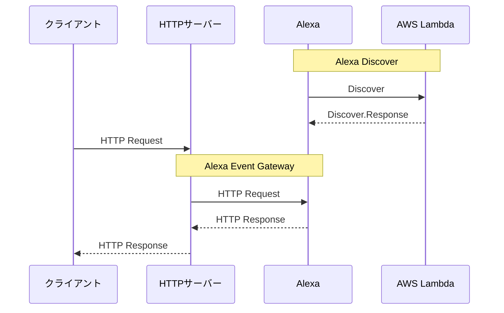

# alexa-skill-endpoint-http-sensor

Alexa Smart Home Skill HTTP Sensor

HTTPリクエストをトリガーに、Alexaの定型アクションを実行するためのコンタクトセンサーです。  
利用には、[alexa-skill-lambda-http-sensor](https://github.com/nana4rider/alexa-skill-lambda-http-sensor)をAWS Lambdaにデプロイする必要があります。



## 初期設定
### 認可コードからリフレッシュトークンを取得
```bash
curl -i -X POST \
   -H "Content-Type:application/json" \
   -d \
'{
  "grant_type": "authorization_code",
  "code": "",
  "client_id": "",
  "client_secret": ""
}' \
 'https://api.amazon.com/auth/o2/token'
```

## API
### コンタクトセンサーを開きます  
```http
GET /[SensorNumber]/open
```
### コンタクトセンサーを閉じます  
```http
GET /[SensorNumber]/close
```
### コンタクトセンサーが閉じていれば開き、開いていれば閉じます  
```http
GET /[SensorNumber]/toggle
```
